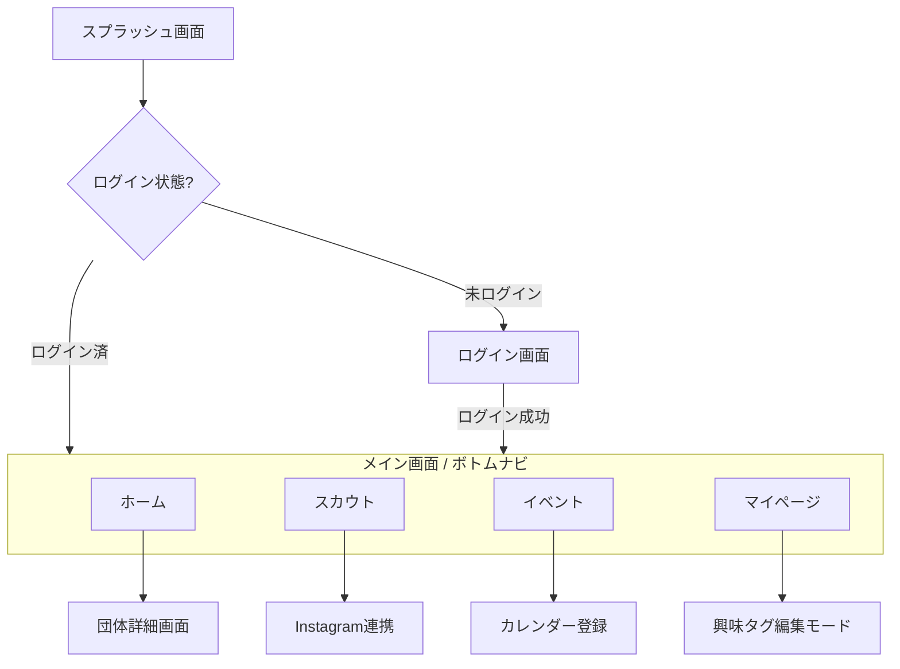

# 基本設計書: D.scout

## 1. 画面遷移図

## 2. 画面一覧・UI構成
| 画面名 | 構成要素 | 特徴 |
| :--- | :--- | :--- |
| **ログイン** | メルアド入力, パスワード入力, ログインボタン | 同志社限定ドメインチェックバリデーション |
| **ホーム** | 検索バー, ジャンルチップ, 2列グリッドカード | キャンパスバッジ、団体プロフィール要約 |
| **スカウト** | スカウト承認ボタン, 団体リスト | 時系列リスト、レッドドット通知、SNS遷移 |
| **イベント** | 日付セクション, キャンパス別カラーラベル | カレンダー連携ボタン |
| **マイページ** | アバター, 基本属性, 興味タグ（Wrapレイアウト） | タグの削除/追加アニメーション |

## 3. システムアーキテクチャ概要

### 3.1 技術スタック
*   **Frontend**: Flutter (Mobile / Web-limited)
    *   State Management: Riverpod (想定)
    *   Animation: Implicit Animations & Motion
*   **Backend**: Python (FastAPI)
    *   認証: 大学ドメインバリデーションロジック内蔵
*   **Database**: PostgreSQL
    *   テーブル: `users`, `organizations`, `scouts`, `events`, `tags`
*   **Infrastructure**: Google Cloud (Cloud Run)

### 3.2 セキュリティ設計
*   **認証**: Firebase Auth 連携（JWT）
*   **ドメイン整合性**: 正規表現 `^[^@]+@(mail\.)?doshisha\.ac\.jp$` による厳格な検証。

## 4. UI/UXの基本指針
*   **Container**: `max-w-md` (448px) 内に中央配置。
*   **Spacing**: 8px単位のグリッド（白基調の余白重視）。
*   **Color**: インディゴブルー (#4F46E5) をプライマリーとし、背景は #F9FAFB。
